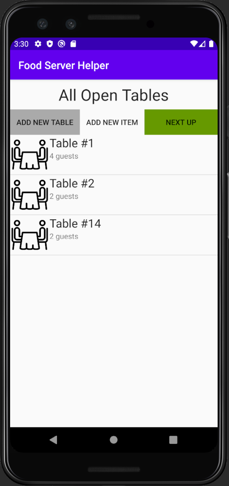
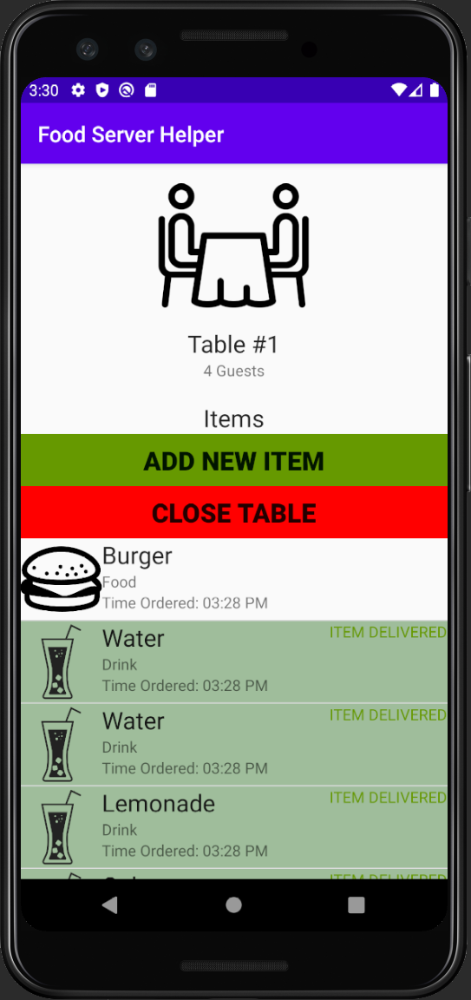
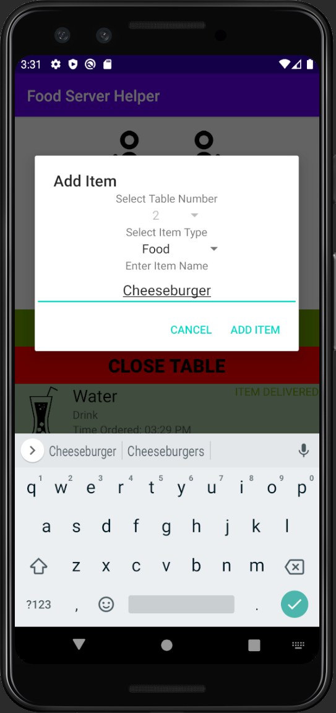
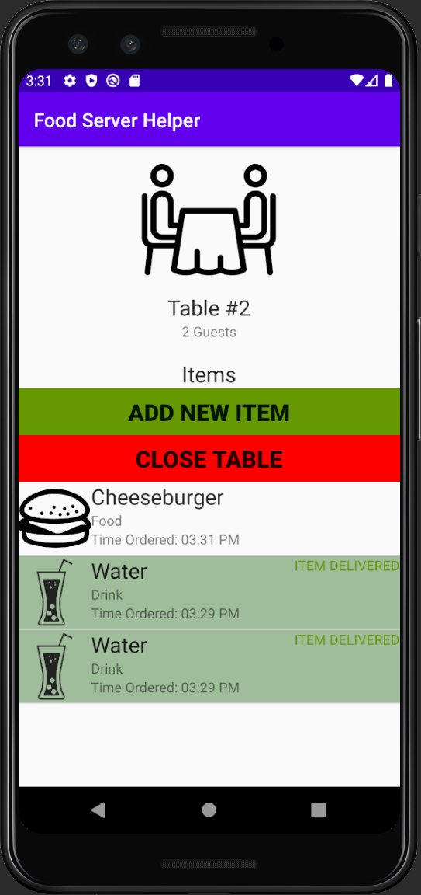
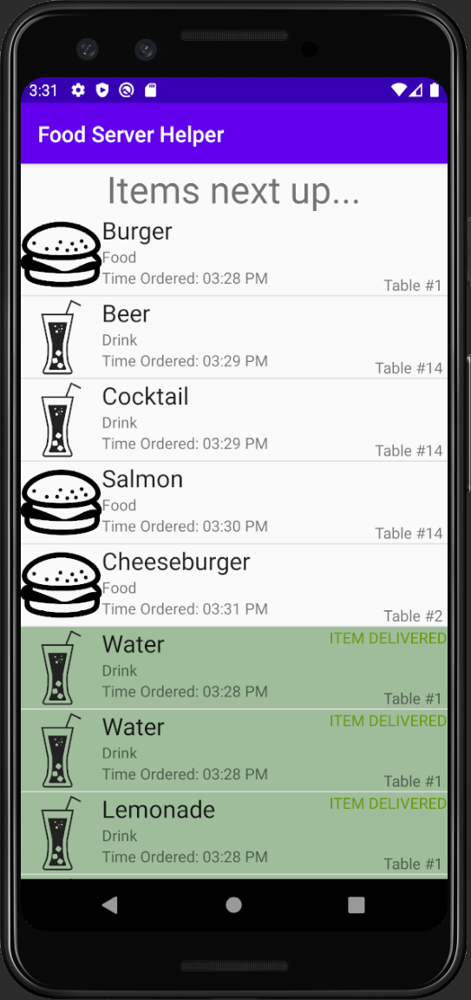
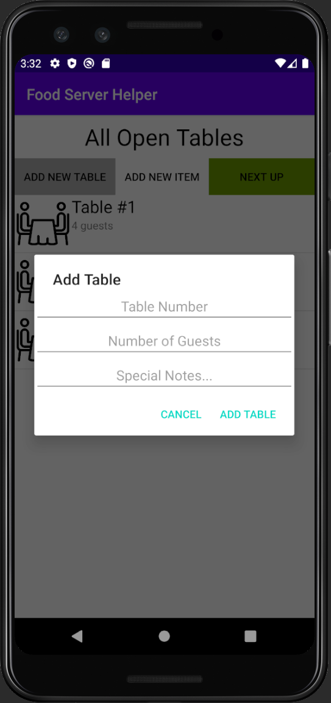

# FoodServerHelperApp
This is an android app written in Java that acts as a utility to help food servers manage their tables and orders to each table. It is object-oriented and follows the MVC structure.

  
  
  

  
  
  

